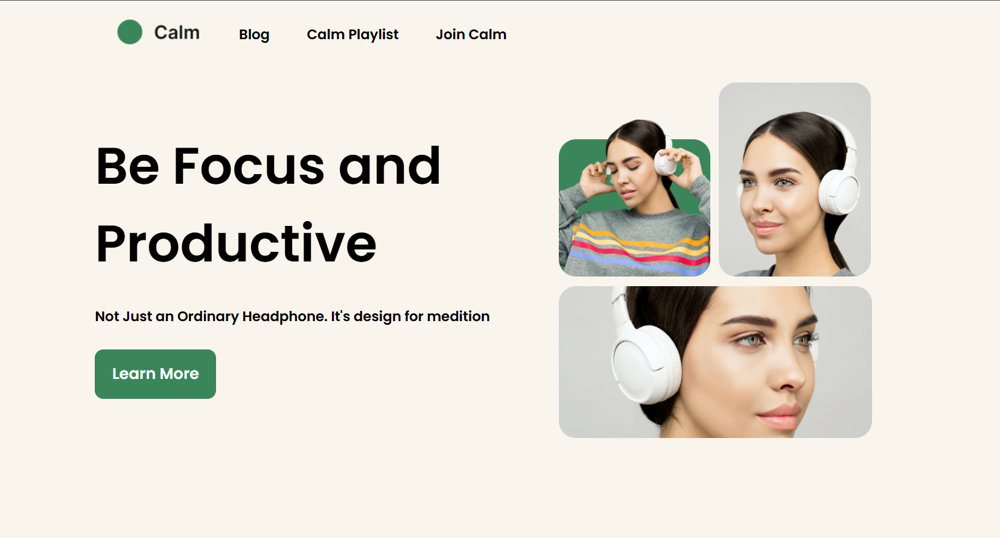

# Calm-Headphone - Single Page Design

This is a simple single-page project showcasing a clean and modern design for a meditation-focused headphone product. The page is built using HTML and CSS, with a responsive layout and a visually appealing design.

## Screenshot

## Technologies Used

- **HTML5**: For the structure of the page.
- **CSS3**: For styling and layout.
- **Google Fonts**: Poppins font for a modern and clean typography.

## How to Use

1. Clone the repository or download the project files.
2. Open `index.html` in your browser to view the page.
